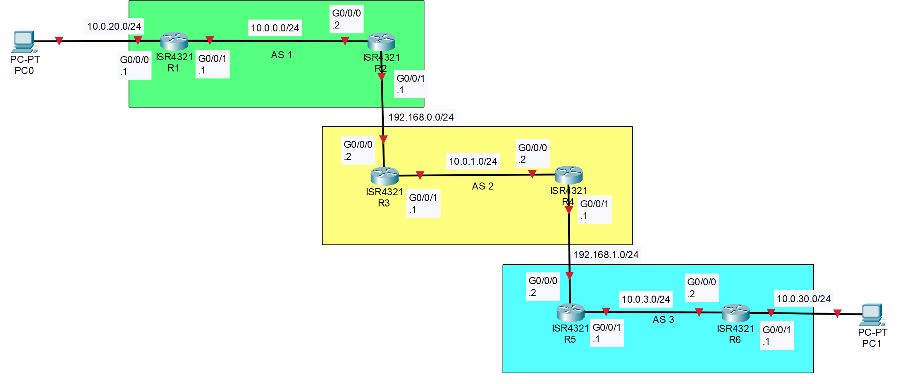
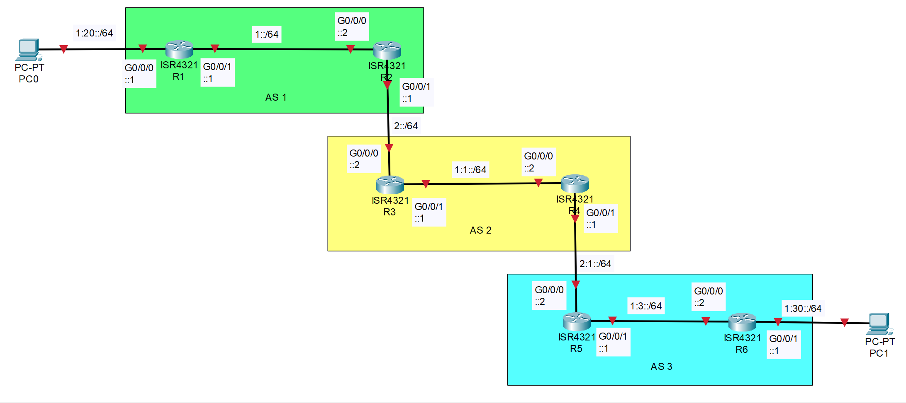

# Exterior Border Gateway Protocol Configuration With IPv4 and IPv6

A lab which configures a computer network with external border gateway protocol. Device configurations and other diagnostic information can be found in the corresponding folders.

Background information on lab concepts can be found here: <https://101zh.github.io/networking/>

## Contents

- [**Purpose**](#purpose)
- [**Lab Summary**](#lab-summary)
- [**Topology**](#topology)
  - [**IPv4 Topology**](#ipv4-topology)
  - [**IPv6 Topology**](#ipv6-topology)
- [**Address Table**](#address-table)
- [**Device Overview**](#device-overview)
- [**ICMPv4 Traceroute Across Network**](#icmpv4-traceroute-across-network-from-pc0)
- [**ICMPv6 Traceroute Across Network**](#icmpv6-traceroute-across-network-from-pc0)
- [**IPv4 Routing Table**](#r1-ipv4-routing-table)
- [**IPv6 Routing Table**](#r1-ipv6-routing-table)
- [**Copyright**](#copyright)

## Purpose

The purpose of this lab is to set up 3 AS’s and use eBGP (external border gateway protocol) to route between the 3 AS’s. To complete this lab, one needs to know how to redistribute routes between gateway protocols and routing protocols, create address-families, and declare eBGP neighbors. And although not central to the eBGP, one still must have the skills needed to set up networks with routing protocols, including advertising interfaces, subnetting, and debugging.

## Lab Summary

In this lab 3 AS’s were set up with eBGP connecting the 3 AS’s together. There are two host devices that are PCs and there are six 4321 routers that are connected via ethernet. To allow host devices to communicate with each other, the routers needed IPv6 and IPv4 routes to redistribute in and out of eBGP.

## Topology

These are the topologies for both IPv4 and IPv6, each link is labeled with the network number and subnet mask of the link. Then each interface is labeled with the last octet or hextet of the usable IPv4/IPv6 address within the subnet of that link.\
Additionally, the PCs can have any IP that is within the subnet of the link that they are on. **DHCP is not setup**.

### IPv4 Topology



### IPv6 Topology



## Address Table

| Device Name | Interface | IPv6 Address | IPv4 Address | Subnet Mask   |
|:------------|:--------- |:------------ |:------------ |:------------- |
| R1          | G0/0/0    | 1:20::1/64   | 10.0.20.1    | 255.255.255.0 |
| R1          | G0/0/1    | 1::1/64      | 10.0.0.1     | 255.255.255.0 |
| R2          | G0/0/0    | 1::2/64      | 10.0.0.2     | 255.255.255.0 |
| R2          | G0/0/1    | 2::1/64      | 192.168.0.1  | 255.255.255.0 |
| R3          | G0/0/0    | 2::2/64      | 192.168.0.2  | 255.255.255.0 |
| R3          | G0/0/1    | 1:1::1/64    | 10.0.-1      | 255.255.255.0 |
| R4          | G0/0/0    | 1:1::2/64    | 10.0.-2      | 255.255.255.0 |
| R4          | G0/0/1    | 2:1::1/64    | 192.168.-1   | 255.255.255.0 |
| R5          | G0/0/0    | 2:1::2/64    | 192.168.-2   | 255.255.255.0 |
| R5          | G0/0/1    | 1:3::1/64    | 10.0.3.1     | 255.255.255.0 |
| R6          | G0/0/0    | 1:3::2/64    | 10.0.3.2     | 255.255.255.0 |
| R6          | G0/0/1    | 1:30::1/64   | 10.0.30.1    | 255.255.255.0 |

## Device Overview

This Topology Consists of...

- Six 4321 routers running Cisco IOS XE Software, Version 16.9 Universal K9

## ICMPv4 Traceroute Across Network From PC0

```text
C:\>tracert 10.0.30.2

Tracing route to DESKTOP-43DJSK3 [10.0.30.2]
over a maximum of 30 hops:

  1    3 ms   <1 ms    <1 ms  10.0.20.1
  2   <1 ms   <1 ms    <1 ms  10.0.0.2
  3   <1 ms    1 ms    <1 ms  192.168.0.2
  4   <1 ms   <1 ms    <1 ms  10.0.1.2
  5   <1 ms   <1 ms    <1 ms  192.168.1.2
  6    1 ms    1 ms     1 ms  10.0.3.2
  7    1 ms   <1 ms     1 ms  DESKTOP-43DJSK3 [10.0.30.2]

Trace complete.
```

## ICMPv6 Traceroute Across Network From PC0

```text
C:\>tracert 1:30::2

Tracing route to 1:30::2 over a maximum of 30 hops

  1   <1 ms   <1 ms    <1 ms  1:20::1
  2    1 ms   <1 ms    <1 ms  1::1
  3    1 ms   <1 ms    <1 ms  2::2
  4    1 ms    1 ms    <1 ms  1:1::2
  5    1 ms   <1 ms     1 ms  2:1::2
  6    1 ms    1 ms     1 ms  1:3::2
  7    1 ms    1 ms     1 ms  1:30::2

Trace complete.
```

## R1 IPv4 Routing Table

```text
R1#show ip route
Codes: L - local, C - connected, S - static, R - RIP, M - mobile, B - BGP
       D - EIGRP, EX - EIGRP external, O - OSPF, IA - OSPF inter area
       N1 - OSPF NSSA external type 1, N2 - OSPF NSSA external type 2
       E1 - OSPF external type 1, E2 - OSPF external type 2
       i - IS-IS, su - IS-IS summary, L1 - IS-IS level-1, L2 - IS-IS level-2
       ia - IS-IS inter area, * - candidate default, U - per-user static route
       o - ODR, P - periodic downloaded static route, H - NHRP, l - LISP
       a - application route
       + - replicated route, % - next hop override, p - overrides from PfR

Gateway of last resort is not set

      10.0.0.0/8 is variably subnetted, 7 subnets, 2 masks
C        10.0.0.0/24 is directly connected, GigabitEthernet0/0/1
L        10.0.0.1/32 is directly connected, GigabitEthernet0/0/1
O E2     10.0.1.0/24 [110/10] via 10.0.0.2, 01:07:00, GigabitEthernet0/0/1
O E2     10.0.3.0/24 [110/10] via 10.0.0.2, 01:06:30, GigabitEthernet0/0/1
C        10.0.20.0/24 is directly connected, GigabitEthernet0/0/0
L        10.0.20.1/32 is directly connected, GigabitEthernet0/0/0
O E2     10.0.30.0/24 [110/10] via 10.0.0.2, 01:06:30, GigabitEthernet0/0/1
O     192.168.0.0/24 [110/2] via 10.0.0.2, 01:09:00, GigabitEthernet0/0/1
O E2  192.168.1.0/24 [110/10] via 10.0.0.2, 01:06:30, GigabitEthernet0/0/1
```

## R1 IPv6 Routing Table

```text
R1#show ipv6 route
IPv6 Routing Table - default - 9 entries
Codes: C - Connected, L - Local, S - Static, U - Per-user Static route
       B - BGP, R - RIP, I1 - ISIS L1, I2 - ISIS L2
       IA - ISIS interarea, IS - ISIS summary, D - EIGRP, EX - EIGRP external
       ND - ND Default, NDp - ND Prefix, DCE - Destination, NDr - Redirect
       O - OSPF Intra, OI - OSPF Inter, OE1 - OSPF ext 1, OE2 - OSPF ext 2
       ON1 - OSPF NSSA ext 1, ON2 - OSPF NSSA ext 2, a - Application
C   1::/64 [0/0]
     via GigabitEthernet0/0/1, directly connected
OE2 1:1::/64 [110/10]
     via FE80::CE7F:76FF:FE6A:B5E0, GigabitEthernet0/0/1
OE2 1:3::/64 [110/10]
     via FE80::CE7F:76FF:FE6A:B5E0, GigabitEthernet0/0/1
C   1:20::/64 [0/0]
     via GigabitEthernet0/0/0, directly connected
L   1:20::1/128 [0/0]
     via GigabitEthernet0/0/0, receive
OE2 1:30::/64 [110/10]
     via FE80::CE7F:76FF:FE6A:B5E0, GigabitEthernet0/0/1
O   2::/64 [110/2]
     via FE80::CE7F:76FF:FE6A:B5E0, GigabitEthernet0/0/1
OE2 2:1::/64 [110/10]
     via FE80::CE7F:76FF:FE6A:B5E0, GigabitEthernet0/0/1
L   FF00::/8 [0/0]
     via Null0, receive
```

## Copyright

MIT License

Copyright (c) 2026 101zh

Permission is hereby granted, free of charge, to any person obtaining a copy
of this software and associated documentation files (the "Software"), to deal
in the Software without restriction, including without limitation the rights
to use, copy, modify, merge, publish, distribute, sublicense, and/or sell
copies of the Software, and to permit persons to whom the Software is
furnished to do so, subject to the following conditions:

The above copyright notice and this permission notice shall be included in all
copies or substantial portions of the Software.

THE SOFTWARE IS PROVIDED "AS IS", WITHOUT WARRANTY OF ANY KIND, EXPRESS OR
IMPLIED, INCLUDING BUT NOT LIMITED TO THE WARRANTIES OF MERCHANTABILITY,
FITNESS FOR A PARTICULAR PURPOSE AND NONINFRINGEMENT. IN NO EVENT SHALL THE
AUTHORS OR COPYRIGHT HOLDERS BE LIABLE FOR ANY CLAIM, DAMAGES OR OTHER
LIABILITY, WHETHER IN AN ACTION OF CONTRACT, TORT OR OTHERWISE, ARISING FROM,
OUT OF OR IN CONNECTION WITH THE SOFTWARE OR THE USE OR OTHER DEALINGS IN THE
SOFTWARE.
